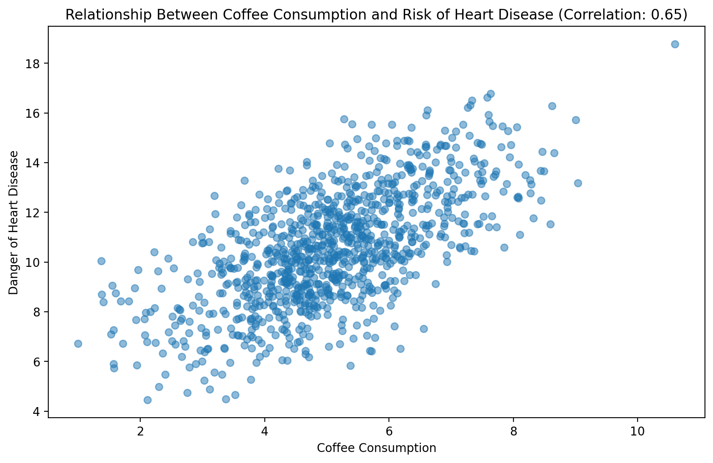
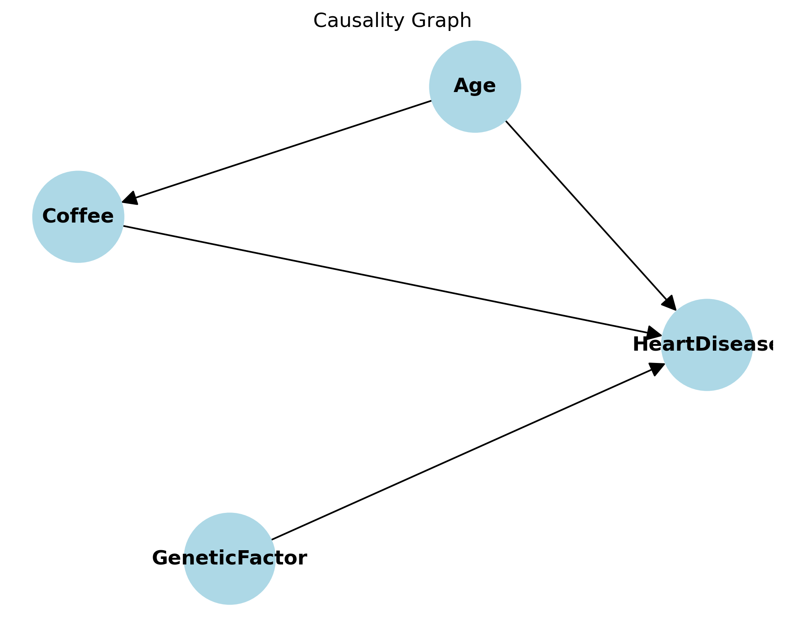

# Coffee ≠ Heart Disease  
### 겉보기 상관관계 vs 진짜 인과관계 (시뮬레이션 기반 교란변수 분석)


> 흔히 “커피 마시면 심장병에 걸린다”는 뉴스를 보지만…  
> 진짜 원인은 **연령**이 교란변수(confounder)였고, 운동이 보호요인이었다는 사실을 시뮬레이션으로 증명합니다.

---

### 주요 분석 결과

| 분석 내용                        | 결과                                      | 통계적 유의성                  |
|--------------------------------|-------------------------------------------|--------------------------------|
| 커피 섭취 ↔ 심장병 위험          | 상관계수 **r = 0.30**                     | Pearson, **p < 0.001**         |
| 연령 → 심장병 위험               | 가장 강한 예측 변수 (β ≈ 0.2)              | **r ≈ 0.60** | **p < 0.001**                  |
| 운동 없음 vs 자주 운동           | 평균 위험도 **-0.85** 낮아짐                | Tukey HSD, **p < 0.001**       |
| 운동 없음 vs 가끔 운동           | 평균 위험도 **-0.33** 낮아짐                | Tukey HSD, p = 0.146 (비유의)   |

**결론**: 커피와 심장병 사이의 양의 상관은 대부분 **연령에 의한 가짜 상관**(spurious correlation)입니다.  
운동을 자주 하는 사람일수록 심장병 위험이 유의미하게 낮아집니다.

---

### 1. 커피 섭취량 vs 심장병 위험도 (산점도)

<p align="center">
  
  <br>
  <em>나이가 많을수록 커피도 더 마시고, 심장병 위험도 높아져 → 겉보기에는 커피가 위험해 보임</em>
</p>

---

### 2. 인과관계 다이어그램 (Causal Diagram)

<p align="center">
  
  <br>
  <em>연령 → 커피, 연령 → 심장병 위험이라는 교란 경로가 존재 → 커피는 직접적 원인이 아님</em>
</p>

---

### 사용 기술 & 방법론
- **데이터 생성**: NumPy로 1,000명 시뮬레이션 데이터 생성  
- **상관분석**: Pearson correlation  
- **집단 비교**: One-way ANOVA + Tukey HSD 사후검정  
- **시각화**: Matplotlib + 수작업 Causal DAG  

---

### 바로 실행해보기
```bash
git clone https://github.com/너의아이디/coffee-heartdisease-stats.git
cd coffee-heartdisease-stats
pip install numpy matplotlib scipy pandas statsmodels
jupyter notebook coffee-and-heartdisease.ipynb
